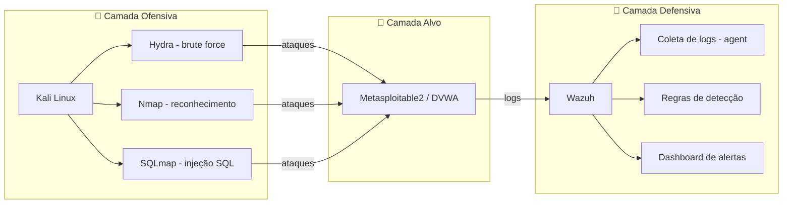

<div align="center">

# 🟣 Purple Team Lab Setup

### Laboratório de simulação ofensiva com detecção defensiva documentada

*Ataque → Log → Detecção → Regra Customizada → Validação*

<br>

[](https://attack.mitre.org/)
[](https://www.kali.org/)
[](https://wazuh.com/)
[](https://www.virtualbox.org/)

<br>

[]()
[]()
[]()

</div>

<br>

## 📖 Sumário

- [Sobre o projeto](#-sobre-o-projeto)
- [Arquitetura](#️-arquitetura)
- [Stack utilizada](#️-stack-utilizada)
- [Como reproduzir](#️-como-reproduzir)
- [Técnicas mapeadas (MITRE ATT&CK)](#-técnicas-mapeadas-mitre-attck)
- [Troubleshooting real](#-troubleshooting-real)
- [Métricas do projeto](#-métricas-do-projeto)
- [Roadmap](#️-roadmap)
- [Referências](#-referências)

<br>

## 🎯 Sobre o projeto

Este repositório documenta a construção — do zero — de um **laboratório de Purple Team**: um ambiente isolado onde técnicas ofensivas reais são executadas contra um alvo intencionalmente vulnerável, enquanto um SIEM observa, registra e (quando necessário) recebe regras de detecção customizadas escritas manualmente.

> A proposta não é apenas "atacar" — é fechar o ciclo completo que times de segurança profissionais usam: **ofensiva documentada + defesa mensurável.**

<br>

## 🏗️ Arquitetura



<br>

<table>
<tr>
<th align="left">🔴 Camada Ofensiva</th>
<th align="left">🎯 Camada Alvo</th>
<th align="left">🔵 Camada Defensiva</th>
</tr>
<tr>
<td valign="top">

**Kali Linux**
- Hydra (brute force)
- Nmap (reconhecimento)
- SQLmap (injeção SQL)

</td>
<td valign="top">

**Metasploitable2 / DVWA**
- Vulnerabilidades clássicas
- Ambiente web exposto

</td>
<td valign="top">

**Wazuh**
- Coleta de logs (agent)
- Regras de detecção
- Dashboard de alertas

</td>
</tr>
</table>

<br>

## 🛠️ Stack utilizada

<div align="center">

| Categoria | Ferramenta | Licença |
|:--|:--|:--:|
| Hypervisor | Oracle VirtualBox 7.2 | Gratuita |
| Ofensiva | Kali Linux | Open Source |
| Alvo vulnerável | Metasploitable2 / DVWA | Open Source |
| SIEM | Wazuh | Open Source |
| Diagramas | draw.io | Gratuita |

</div>

<br>

## ⚙️ Como reproduzir

<details>
<summary><b>1. Pré-requisitos do host</b></summary>
<br>

- Virtualização de hardware habilitada na BIOS (Intel VT-x / AMD-V)
- Hyper-V e Virtual Machine Platform **desabilitados** (Windows)
- VirtualBox 7.x + Extension Pack instalados

📄 Guia completo: [`docs/host-setup.md`](docs/host-setup.md)

</details>

<details>
<summary><b>2. Instalação do Kali Linux</b></summary>
<br>

VM criada via linha de comando (`VBoxManage`), instalação via ISO oficial, particionamento manual guiado.

📄 Guia completo: [`docs/kali-install.md`](docs/kali-install.md)

</details>

<details>
<summary><b>3. Instalação do alvo vulnerável</b></summary>
<br>

Metasploitable2 (VM pronta) ou DVWA via Docker.

📄 Guia completo: [`docs/target-setup.md`](docs/target-setup.md)

</details>

<details>
<summary><b>4. Instalação do Wazuh (SIEM)</b></summary>
<br>

Instalação single-node via script oficial em VM Ubuntu Server dedicada.

📄 Guia completo: [`docs/wazuh-setup.md`](docs/wazuh-setup.md)

</details>

<details>
<summary><b>5. Configuração da rede interna isolada</b></summary>
<br>

Troca de NAT para Internal Network (`purple-lab-net`) após validação de cada componente.

📄 Guia completo: [`docs/network-setup.md`](docs/network-setup.md)

</details>

<br>

## 🎯 Técnicas mapeadas (MITRE ATT&CK)

<div align="center">

| Técnica | ID | Ferramenta | Detecção | Regra customizada |
|:--|:--:|:--|:--:|:--:|
| Brute Force (SSH) | `T1110` | Hydra | ✅ | ✅ |
| Network Scanning | `T1046` | Nmap | ✅ | ⚠️ Parcial |
| SQL Injection | `T1190` | SQLmap | 🔜 | 🔜 |

</div>

<br>

## 🐛 Troubleshooting real

> Esta seção documenta problemas **reais** enfrentados durante a construção — não é uma lista teórica.

<details>
<summary><b>⚠️ Conflito entre Hyper-V e VirtualBox</b></summary>
<br>

**Sintoma:** VM não ligava.
**Causa:** Hyper-V e VirtualMachinePlatform competem pelo hypervisor com o VirtualBox.

```powershell
Disable-WindowsOptionalFeature -Online -FeatureName Microsoft-Hyper-V-All -NoRestart
Disable-WindowsOptionalFeature -Online -FeatureName VirtualMachinePlatform -NoRestart
bcdedit /set hypervisorlaunchtype off
```

</details>

<details>
<summary><b>⚠️ AMD-V (SVM) desabilitado na BIOS</b></summary>
<br>

**Sintoma:** `VERR_SVM_DISABLED` mesmo com Hyper-V desativado no Windows.
**Causa:** placas Gigabyte frequentemente vêm com SVM Mode desabilitado por padrão.
**Solução:** BIOS → M.I.T. → Advanced Frequency Settings → Advanced CPU Core Settings → SVM Mode → `Enabled`.

</details>

<details>
<summary><b>⚠️ Senha rejeitada na tela de login pós-instalação</b></summary>
<br>

**Causa provável:** incompatibilidade de layout de teclado entre instalador e sessão gráfica.
**Solução:** boot via GRUB → Advanced options → recovery mode → root shell → `passwd <usuario>`.

</details>

<details>
<summary><b>⚠️ Guest Additions: dispositivo de CD não montava</b></summary>
<br>

**Sintoma:** `mount: Can't open blockdev`.
**Causa:** imagem de CD não estava de fato inserida na VM.
**Solução:** reinserir via `Dispositivos > Inserir imagem de CD das Adições de Convidado`, validar com `lsblk` (procurar `sr0`), montar via `/dev/sr0`.

</details>

<br>

## 📊 Métricas do projeto

<div align="center">

| Métrica | Valor |
|:--|:--:|
| Tempo total de setup | ~3h |
| RAM alocada (Kali) | 4GB / 2 vCPUs |
| Armazenamento | SSD NVMe dedicado |
| Técnicas mapeadas | 3 |
| Regras customizadas escritas | 1 |

</div>

<br>

## 🗺️ Roadmap

- [x] Setup do host (BIOS + Hyper-V)
- [x] Instalação do Kali Linux
- [ ] Instalação do alvo vulnerável
- [ ] Rede interna isolada
- [ ] Instalação do Wazuh
- [ ] Execução e documentação dos 3 ataques mapeados
- [ ] Regras de detecção customizadas

<br>

## 📚 Referências

- [MITRE ATT&CK Framework](https://attack.mitre.org/)
- [Documentação oficial do Kali Linux](https://www.kali.org/docs/)
- [Documentação oficial do Wazuh](https://documentation.wazuh.com/)

<br>

---

<div align="center">

*Projeto educacional desenvolvido como parte de estudos de pós-graduação em Segurança da Informação.*

</div>
